# 🔗 LinkedIn URL Import Setup Guide

## 🚀 Feature Overview

The LinkedIn URL Import feature uses **3 scraping methods** in order of reliability:

1. **RapidAPI LinkedIn Scraper** (Best quality, most reliable)
2. **AI-Powered Extraction** (Good quality, uses OpenAI GPT-4o-mini)
3. **Basic Web Scraping** (Limited data, no API keys needed)

The system tries each method automatically until one succeeds.

---

## 📋 Quick Setup (Choose One)

### ✨ **Option 1: RapidAPI (Recommended - Best Results)**

**Why?** Most reliable, complete data extraction, free tier available

**Steps:**

1. Go to [RapidAPI LinkedIn Data API](https://rapidapi.com/linkedin-data-api/api/linkedin-data-api)
2. Sign up / Login to RapidAPI
3. Subscribe to **FREE plan** (500 requests/month free!)
4. Copy your API key from dashboard
5. Add to `.env.local`:

```env
RAPIDAPI_KEY=your_rapidapi_key_here
```

6. Restart dev server: `npm run dev`

**Cost:** FREE (500 requests/month)

---

### 🤖 **Option 2: OpenAI (Good Alternative)**

**Why?** Already have OpenAI key? Uses AI to intelligently parse LinkedIn HTML

**Steps:**

1. Use your existing OpenAI API key OR get one at [OpenAI Platform](https://platform.openai.com/)
2. Add to `.env.local`:

```env
OPENAI_API_KEY=your_openai_key_here
```

3. Restart dev server: `npm run dev`

**Cost:** ~$0.001 per profile import (very cheap!)

---

### 🔨 **Option 3: Basic Scraping (No Setup)**

**Why?** Works immediately without any API keys

**Limitations:**
- Only extracts basic info (name, headline, location, summary)
- No work experience, education, or skills
- May be blocked by LinkedIn occasionally

**Steps:** Nothing! Just use it. The system falls back to this automatically.

---

## 🎯 How It Works

```mermaid
graph TD
    A[User enters LinkedIn URL] --> B[Try RapidAPI]
    B -->|Success| Z[✅ Return Profile Data]
    B -->|Fails| C[Try AI Extraction]
    C -->|Success| Z
    C -->|Fails| D[Try Basic Scraping]
    D -->|Success| Z
    D -->|Fails| E[❌ Show Error + Recommendations]
```



---

## 🛠️ Environment Variables Reference

Add these to your `.env.local` file in project root:

```env
# LinkedIn URL Import (Choose at least one)

# Option 1: RapidAPI (Recommended - Best Results)
RAPIDAPI_KEY=your_rapidapi_key_here

# Option 2: OpenAI (Good Alternative)
OPENAI_API_KEY=your_openai_key_here

# Note: If both are set, RapidAPI is tried first (more reliable)
# If neither is set, basic scraping is used (limited data)
```

---

## 📊 Method Comparison

| Method | Data Quality | Reliability | Cost | Setup Time |
|--------|--------------|-------------|------|------------|
| **RapidAPI** | ⭐⭐⭐⭐⭐ Excellent | ⭐⭐⭐⭐⭐ Very High | Free (500/mo) | 2 minutes |
| **AI Extraction** | ⭐⭐⭐⭐ Good | ⭐⭐⭐⭐ High | ~$0.001/import | 1 minute |
| **Basic Scraping** | ⭐⭐ Limited | ⭐⭐⭐ Medium | Free | 0 minutes |

---

## 🧪 Testing

### Test with RapidAPI:
```bash
# Make sure RAPIDAPI_KEY is in .env.local
npm run dev
# Go to http://localhost:3000/resume
# Click "LinkedIn Import" tab
# Enter: https://linkedin.com/in/williamhgates
# Should see: "✅ Profile imported successfully! Used RapidAPI to extract..."
```

### Test with OpenAI:
```bash
# Remove RAPIDAPI_KEY temporarily, keep OPENAI_API_KEY
npm run dev
# Same test as above
# Should see: "✅ Profile imported successfully! Used AI-Powered Extraction to extract..."
```

### Test Basic Scraping:
```bash
# Remove both API keys temporarily
npm run dev
# Same test as above
# Should see: "✅ Profile imported successfully! Used Basic Web Scraping to extract..."
# Note: Will show limited data warning
```

---

## 🐛 Troubleshooting

### ❌ "Failed to import LinkedIn profile"

**Error**: All scraping methods failed

**Solutions**:
1. Check if `.env.local` exists in project root
2. Verify API keys are correct (no extra spaces)
3. Restart dev server after adding keys
4. Check console for detailed error messages
5. Try alternative methods (PDF Export or Manual Entry)

### ⚠️ "Limited data extracted"

**Issue**: Only name and headline imported

**Why**: Basic scraping can't access full LinkedIn profiles without login

**Solution**: 
- Set up RapidAPI or OpenAI keys (see above)
- OR use PDF Export method (100% reliable)

### 🔐 "LinkedIn may be blocking automated access"

**Issue**: LinkedIn detected scraping

**Solution**:
- Wait a few minutes and try again
- Use RapidAPI (bypasses LinkedIn blocks)
- Use PDF Export method (always works)

---

## 💡 Pro Tips

### 1. **Use PDF Export for Complete Data**
Even with API keys, PDF Export is often the most reliable method:
- Go to LinkedIn → More → Save to PDF
- Upload PDF in DocMagic
- 100% success rate, full data extraction

### 2. **Rate Limiting**
If using RapidAPI free tier:
- 500 requests/month = ~16 per day
- Perfect for personal use
- Upgrade if needed for high volume

### 3. **Privacy & Security**
- API keys are stored server-side only (`.env.local`)
- Never exposed to client browser
- LinkedIn profile URLs are public data
- No LinkedIn login credentials needed

### 4. **Fallback Strategy**
System automatically tries methods in this order:
1. RapidAPI → 2. OpenAI → 3. Basic → 4. Show alternatives

You can rely on it to use the best available method!

---

## 📸 Expected Behavior

### ✅ Success (With RapidAPI):
```
✅ Profile imported successfully!
Used RapidAPI to extract your LinkedIn data

[Full profile with experience, education, skills loaded]
```

### ✅ Success (With OpenAI):
```
✅ Profile imported successfully!
Used AI-Powered Extraction to extract your LinkedIn data

[Full profile data loaded]
```

### ✅ Success (Basic Scraping):
```
✅ Profile imported successfully!
Used Basic Web Scraping to extract your LinkedIn data

ℹ️ Note
Limited data extracted. LinkedIn restricts public profile access.
For complete data, please use PDF Export method.
```

### ⚠️ Partial Failure (No API Keys):
```
⚠️ URL Import Temporarily Unavailable
All scraping methods are currently unavailable.
Please use PDF Export (100% reliable) or Manual Entry.

💡 Recommendations:
- Configure RAPIDAPI_KEY for best results
- Configure OPENAI_API_KEY for AI extraction
- Use PDF Export method (always works)
```

---

## 🎨 User Experience

The feature has been designed for **graceful degradation**:

1. **Best Case**: RapidAPI configured → Full data extraction
2. **Good Case**: OpenAI configured → AI-powered extraction
3. **Fallback Case**: No keys → Basic extraction with helpful note
4. **Worst Case**: All fail → Clear alternatives (PDF/Manual)

Users always have a working path forward! 🚀

---

## 🔄 Migration from Old System

**Old System (501 Not Implemented)**:
- Always returned 501 status
- No actual import functionality
- Just showed error message

**New System (Fully Functional)**:
- 3 working scraping methods
- Automatic fallback logic
- Graceful error handling
- Clear setup instructions

**No Breaking Changes**: Existing PDF and Manual import methods still work perfectly!

---

## 📝 Summary

| Setup Option | Time | Cost | Result |
|--------------|------|------|--------|
| **Do Nothing** | 0 min | Free | Basic scraping (limited data) |
| **Add OpenAI Key** | 1 min | ~$0.001/import | Good quality extraction |
| **Add RapidAPI Key** | 2 min | Free (500/mo) | ⭐ Best quality extraction |
| **Use PDF Export** | 0 setup | Free | 💯 100% reliable (recommended) |

**Recommendation**: Add RapidAPI key for best URL import experience, but keep PDF Export as primary method for users!

---

## 🎯 Next Steps

1. Choose your preferred method (RapidAPI recommended)
2. Add API key to `.env.local`
3. Restart dev server
4. Test with a LinkedIn URL
5. Enjoy automatic profile imports! 🎉

---

## 🤝 Need Help?

- Check browser console for detailed error messages
- Review recommendations shown in UI
- Try PDF Export method (always works 100%)
- Open GitHub issue if problems persist

---

*Last Updated: October 16, 2025*
*Feature Status: ✅ Production Ready*
