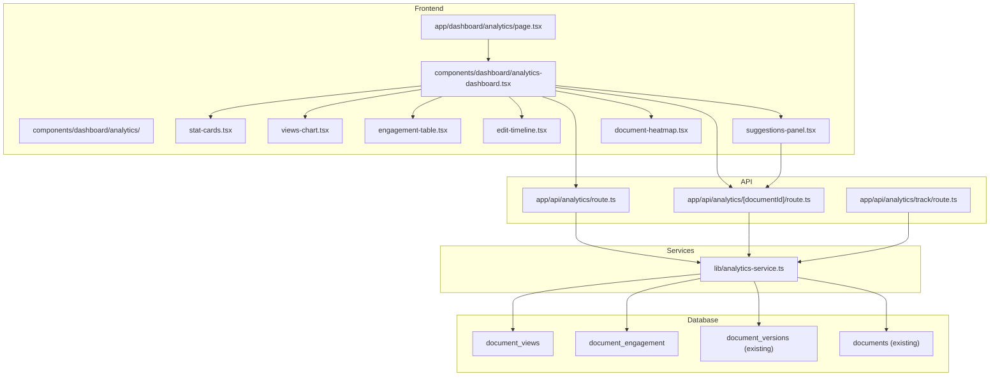

# Document Analytics Dashboard — Implementation Plan

> **Issue:** [#107 — Document Analytics Dashboard](https://github.com/Muneerali199/DraftDeckAI/issues/107)
> **Goal:** Reveal usage stats, unique views, edit history, and engagement metrics. Suggest improvements based on document traffic and reader feedback.

---

## Architecture Overview



---

## Step-by-Step Implementation

### Phase 1: Database Schema (Supabase Migration)

**File:** `supabase/migrations/20260515000000_add_document_analytics.sql`

Create two new tables to track analytics data that doesn't already exist in the schema.

#### 1.1 `document_views` Table

Tracks every view event per document (both owner and external viewers for shared/public docs).

| Column | Type | Description |
|---|---|---|
| `id` | `UUID PK` | Auto-generated |
| `document_id` | `UUID FK → documents.id` | Which document was viewed |
| `viewer_id` | `UUID FK → auth.users.id NULL` | Authenticated viewer (null = anonymous) |
| `viewer_ip_hash` | `TEXT` | SHA-256 hash of viewer IP (for unique-view counting without storing PII) |
| `referrer` | `TEXT NULL` | Where the viewer came from |
| `user_agent` | `TEXT NULL` | Browser/device info |
| `duration_seconds` | `INTEGER DEFAULT 0` | Time spent on document |
| `viewed_at` | `TIMESTAMPTZ DEFAULT NOW()` | Timestamp |

#### 1.2 `document_engagement` Table

Aggregated engagement events (downloads, shares, copies, prints, feedback).

| Column | Type | Description |
|---|---|---|
| `id` | `UUID PK` | Auto-generated |
| `document_id` | `UUID FK → documents.id` | Target document |
| `user_id` | `UUID FK → auth.users.id NULL` | Who performed the action |
| `event_type` | `TEXT CHECK` | One of: `download`, `share`, `copy`, `print`, `feedback`, `edit` |
| `event_data` | `JSONB DEFAULT '{}'` | Extra metadata (e.g., `{ rating: 4, comment: "..." }` for feedback) |
| `created_at` | `TIMESTAMPTZ DEFAULT NOW()` | Timestamp |

#### 1.3 Indexes & RLS

- Indexes on `document_id`, `viewer_id`, `viewed_at`, `event_type`
- RLS policies: document owners can read all analytics for their docs; viewers cannot see analytics
- A database function `get_document_analytics_summary(doc_id UUID)` that returns aggregated stats in one call

> [!IMPORTANT]
> Both tables reference `documents.id`. The existing `document_versions` table (from [20250101000000_add_collaboration_features.sql](file:///c:/practice/Draftdeckai/supabase/migrations/20250101000000_add_collaboration_features.sql)) already tracks edit history — we'll **reuse** it rather than duplicating.

---

### Phase 2: TypeScript Types

**File:** `types/analytics.ts`

```typescript
export interface DocumentViewEvent {
  id: string;
  document_id: string;
  viewer_id: string | null;
  viewer_ip_hash: string;
  referrer: string | null;
  user_agent: string | null;
  duration_seconds: number;
  viewed_at: string;
}

export interface DocumentEngagementEvent {
  id: string;
  document_id: string;
  user_id: string | null;
  event_type: 'download' | 'share' | 'copy' | 'print' | 'feedback' | 'edit';
  event_data: Record<string, any>;
  created_at: string;
}

export interface AnalyticsSummary {
  total_views: number;
  unique_views: number;
  total_edits: number;
  total_downloads: number;
  total_shares: number;
  avg_view_duration: number;       // seconds
  views_trend: TrendPoint[];       // last 30 days
  engagement_breakdown: Record<string, number>;
  top_referrers: { referrer: string; count: number }[];
  recent_activity: ActivityItem[];
  suggestions: Suggestion[];
}

export interface TrendPoint {
  date: string;       // ISO date
  views: number;
  unique_views: number;
}

export interface ActivityItem {
  type: 'view' | 'edit' | 'download' | 'share' | 'feedback';
  description: string;
  timestamp: string;
  actor_name?: string;
}

export interface Suggestion {
  id: string;
  category: 'content' | 'engagement' | 'seo' | 'sharing';
  title: string;
  description: string;
  priority: 'high' | 'medium' | 'low';
  action_label?: string;
  action_href?: string;
}
```

---

### Phase 3: Analytics Service

**File:** `lib/analytics-service.ts`

A service class following the same pattern as [version-history-service.ts](file:///c:/practice/Draftdeckai/lib/version-history-service.ts) and [collaboration-service.ts](file:///c:/practice/Draftdeckai/lib/collaboration-service.ts).

#### Key Methods

| Method | Purpose |
|---|---|
| `trackView(documentId, viewerId?, ipHash, referrer?, userAgent?)` | Record a view event |
| `trackEngagement(documentId, userId, eventType, eventData?)` | Record download/share/copy/print/feedback |
| `updateViewDuration(viewId, durationSeconds)` | Update time-on-page for a view |
| `getAnalyticsSummary(documentId, dateRange?)` | Aggregated stats for the dashboard |
| `getViewsTrend(documentId, days?)` | Daily view counts for charting |
| `getEditHistory(documentId)` | Wraps existing `VersionHistoryService.getVersions()` |
| `getTopDocuments(userId, limit?)` | Ranked list of user's most-viewed documents |
| `generateSuggestions(documentId)` | AI-free heuristic suggestions based on metrics |

#### Suggestion Generation Logic (Heuristics)

The `generateSuggestions` method doesn't need AI — it uses simple rules:

| Condition | Suggestion |
|---|---|
| `views > 50 && shares == 0` | "Your document gets traffic but no shares. Add a share CTA!" |
| `avg_duration < 15` | "Readers leave quickly. Consider shortening or improving the intro." |
| `edits == 0 && age > 30 days` | "This document hasn't been updated in a month. Refresh it!" |
| `views == 0 && age > 7 days` | "No views yet. Share this document or make it public." |
| `downloads > views * 0.3` | "Great download rate! Consider adding a watermark for branding." |
| `feedback.avg_rating < 3` | "Reader feedback is below average. Review the comments." |

---

### Phase 4: API Routes

#### 4.1 Analytics Summary Endpoint

**File:** `app/api/analytics/route.ts`

- **GET** `/api/analytics?userId=...` → Returns top-level dashboard stats across all documents for the authenticated user.

#### 4.2 Per-Document Analytics

**File:** `app/api/analytics/[documentId]/route.ts`

- **GET** `/api/analytics/{documentId}?range=7d|30d|90d|all` → Returns `AnalyticsSummary` for a single document.

#### 4.3 Event Tracking Endpoint

**File:** `app/api/analytics/track/route.ts`

- **POST** `/api/analytics/track` → Body: `{ documentId, eventType, eventData? }`
- Lightweight, called from the client when a user views, downloads, shares, etc.
- Uses IP hashing for anonymous unique-view tracking.
- Rate-limited in middleware (already configured in [middleware.ts](file:///c:/practice/Draftdeckai/middleware.ts)).

> [!TIP]
> The tracking endpoint should be fire-and-forget from the client. Use `navigator.sendBeacon` for view-duration updates on page unload.

---

### Phase 5: Frontend Components

All components use the existing UI primitives from `components/ui/` (Card, Tabs, Progress, Badge, Skeleton, etc.) and the `recharts` library already in [package.json](file:///c:/practice/Draftdeckai/package.json#L135).

#### 5.1 Dashboard Page

**File:** `app/dashboard/analytics/page.tsx`

```tsx
// Server Component — metadata + auth guard
export const metadata = {
  title: "Analytics | DraftDeckAI",
  description: "View document usage statistics, engagement metrics, and improvement suggestions",
};

export default function AnalyticsPage() {
  return <AnalyticsDashboard />;
}
```

#### 5.2 Main Dashboard Component

**File:** `components/dashboard/analytics-dashboard.tsx`

Client component (`"use client"`) following the pattern in [history-dashboard.tsx](file:///c:/practice/Draftdeckai/components/dashboard/history-dashboard.tsx):

- Uses `createClient()` from `@/lib/supabase/client`
- Auth check via `supabase.auth.getSession()`
- Fetches all user documents + their analytics summaries
- Contains the overall layout with background orbs/mesh-gradient matching the existing app theme

**Layout structure:**
1. **Header** — "Document Analytics" title with sparkle badge
2. **Overview Stat Cards** — Total views, unique visitors, total edits, avg. read time, total downloads (animated counters)
3. **Document Selector** — Dropdown to pick a specific document or "All Documents"
4. **Tabbed Content:**
   - **Overview** — Views trend chart (line/area chart via recharts) + engagement donut chart
   - **Engagement** — Table of all engagement events with filtering
   - **Edit History** — Timeline visualization of document versions (pulls from `document_versions`)
   - **Suggestions** — AI-free improvement cards based on heuristics

#### 5.3 Sub-Components

**Directory:** `components/dashboard/analytics/`

| Component | File | Description |
|---|---|---|
| `AnalyticsStatCards` | `stat-cards.tsx` | 5 glass-morphism stat cards with animated number counters and trend arrows. Uses the existing `glass-effect`, `bolt-gradient-text` CSS classes. |
| `ViewsChart` | `views-chart.tsx` | Recharts `AreaChart` with gradient fill. 7d/30d/90d toggle. Responsive. Dark mode aware. |
| `EngagementTable` | `engagement-table.tsx` | Sortable/filterable table using `components/ui/table`. Shows event type icons, actor, timestamp, and details. |
| `EditTimeline` | `edit-timeline.tsx` | Vertical timeline of document versions from `VersionHistoryService`. Shows version diffs, auto-save vs manual, tags. |
| `SuggestionsPanel` | `suggestions-panel.tsx` | Card list of actionable suggestions. Each card has priority badge, description, and optional action button. |
| `DocumentHeatmap` | `document-heatmap.tsx` | GitHub-style contribution heatmap showing activity intensity per day over the last 12 weeks. |

---

### Phase 6: Event Tracking Integration

Hook analytics tracking into **existing** user flows:

| User Action | Where to Add Tracking | Event Type |
|---|---|---|
| View document | Editor pages (`resume-editor`, `presentation`, `documents/[id]`) | `view` |
| Download PDF/PPTX | Export buttons (existing export flows) | `download` |
| Share document | Collaboration share dialog | `share` |
| Copy link | Share URL copy button | `copy` |
| Print document | Print button | `print` |
| Edit & save | Editor auto-save / manual save | `edit` |

**Implementation approach:** Create a lightweight React hook `useDocumentAnalytics(documentId)` that:
- Tracks a `view` event on mount
- Tracks `duration` on unmount via `sendBeacon`
- Exposes `trackEvent(type, data?)` for imperative tracking

**File:** `hooks/use-document-analytics.ts`

---

### Phase 7: Navigation Integration

Add the Analytics link to the existing site header and dashboard navigation.

**Files to modify:**
- [components/site-header.tsx](file:///c:/practice/Draftdeckai/components/site-header.tsx) — Add "Analytics" nav item with `BarChart3` icon
- [components/dashboard/history-dashboard.tsx](file:///c:/practice/Draftdeckai/components/dashboard/history-dashboard.tsx) — Add a "View Analytics" button that links to `/dashboard/analytics`

---

## File Tree Summary

```
New Files (11):
├── supabase/migrations/20260515000000_add_document_analytics.sql
├── types/analytics.ts
├── lib/analytics-service.ts
├── hooks/use-document-analytics.ts
├── app/api/analytics/route.ts
├── app/api/analytics/[documentId]/route.ts
├── app/api/analytics/track/route.ts
├── app/dashboard/analytics/page.tsx
├── components/dashboard/analytics-dashboard.tsx
└── components/dashboard/analytics/
    ├── stat-cards.tsx
    ├── views-chart.tsx
    ├── engagement-table.tsx
    ├── edit-timeline.tsx
    ├── suggestions-panel.tsx
    └── document-heatmap.tsx

Modified Files (2):
├── components/site-header.tsx          (add nav link)
└── components/dashboard/history-dashboard.tsx  (add analytics button)
```

---

## Implementation Order & Estimated Effort

| # | Phase | Files | Effort |
|---|---|---|---|
| 1 | Database Migration | 1 SQL file | ~30 min |
| 2 | TypeScript Types | 1 file | ~15 min |
| 3 | Analytics Service | 1 file | ~1.5 hr |
| 4 | API Routes | 3 files | ~1 hr |
| 5 | Tracking Hook | 1 file | ~30 min |
| 6 | Dashboard Page + Main Component | 2 files | ~2 hr |
| 7 | Sub-Components (charts, tables, etc.) | 6 files | ~3 hr |
| 8 | Navigation Integration | 2 files (modifications) | ~20 min |
| 9 | Event Tracking Integration | Modifications across editor pages | ~1 hr |
| 10 | Testing & Polish | — | ~1.5 hr |
| | **Total** | **17 files** | **~11.5 hr** |

---

## Design Decisions

> [!NOTE]
> **Why no new npm dependencies?** The project already has `recharts` for charts, `lucide-react` for icons, `date-fns` for date formatting, and `framer-motion` for animations. Everything needed is already installed.

> [!NOTE]
> **Why heuristic suggestions instead of AI?** Avoids burning API credits on a feature that runs frequently. The rules-based approach is fast, free, and deterministic. Can always upgrade to AI-powered suggestions later.

> [!NOTE]
> **Why IP hashing?** Allows counting unique anonymous visitors without storing identifiable data. Compliant with privacy best practices.

> [!WARNING]
> **Existing `document_versions` table:** The edit history timeline reuses the existing [version-history-service.ts](file:///c:/practice/Draftdeckai/lib/version-history-service.ts) rather than creating a parallel system. This avoids data duplication and stays consistent with the existing collaboration architecture.

---

## Key Patterns to Follow

Based on codebase analysis:

1. **Supabase client usage:** Use `createClient()` from `@/lib/supabase/client` in client components, `createRoute()` from `@/lib/supabase/server` in API routes
2. **Service pattern:** Singleton class export (like `collaborationService`, `versionHistoryService`)
3. **Component styling:** Glass-morphism cards (`glass-effect`), gradient text (`bolt-gradient-text`), floating orbs, shimmer effects — match the [history-dashboard.tsx](file:///c:/practice/Draftdeckai/components/dashboard/history-dashboard.tsx) aesthetic
4. **Auth pattern:** `supabase.auth.getSession()` in client components, `supabase.auth.getUser()` in API routes
5. **Toast notifications:** `useToast()` from `@/hooks/use-toast`
6. **Loading states:** `Loader2` spinner with glass-effect container
